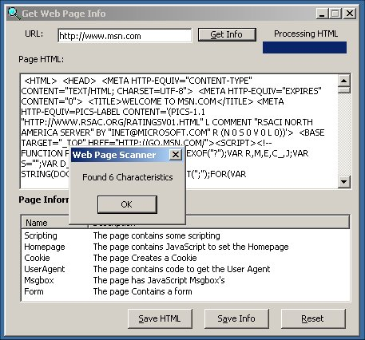



## Web Page Scanner

### Description

This program connects to a website and grabs the html source, it then looks in the source for different things like popups, java applets, 404 errors, page redirects, adds to bookmarks, sets homepage, embedded objects, frames, cookies, javascript alerts, and other things. With peoples help this could be something very big, please send your comments and votes. Thanks

**Update: I have added the ability to save the report and html.
 
### More Info
 

             |
---                |---
**Submitted On**   |2001-10-22 16:04:52
**By**             |[Rob R](https://github.com/Planet-Source-Code/PSCIndex/blob/master/ByAuthor/rob-r.md)
**Level**          |Intermediate
**User Rating**    |5.0 (15 globes from 3 users)
**Compatibility**  |VB 5\.0, VB 6\.0
**Category**       |[Internet/ HTML](https://github.com/Planet-Source-Code/PSCIndex/blob/master/ByCategory/internet-html__1-34.md)
**World**          |[Visual Basic](https://github.com/Planet-Source-Code/PSCIndex/blob/master/ByWorld/visual-basic.md)
**Archive File**   |[Web Page S3044510222001\.zip](https://github.com/Planet-Source-Code/rob-r-web-page-scanner__1-28309/archive/master.zip)

